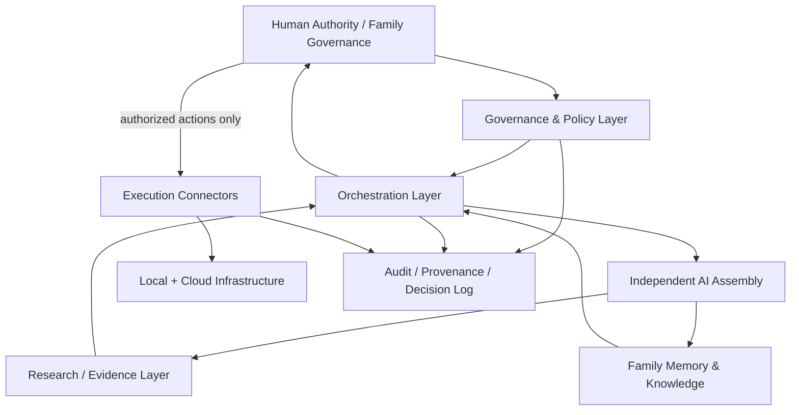

# SFII

**Sovereign Family Intelligence Infrastructure**

SFII is a research and architecture project for human-governed intelligence infrastructure designed to support multigenerational families and family offices without transferring final authority to AI systems.

**Status:** Concept · Research  
**Maturity:** Architecture under development  
**Maintenance:** Ongoing  
**Repository role:** Public research, governance and architecture record

---

## Core Question

How can a family build a durable intelligence infrastructure that can:

- preserve institutional memory across generations
- use multiple AI systems without depending on one model or vendor
- compare independent analyses instead of accepting one answer
- support research, planning and execution
- maintain clear authority, provenance and accountability
- survive model, vendor and infrastructure changes
- keep final sovereignty with humans

SFII treats this as a **governance and systems problem**, not as a chatbot project.

---

## Sovereign Human Authority — SHA

SFII is governed by **Sovereign Human Authority (SHA)**:

> AI may propose, analyze, challenge, simulate and execute within explicitly granted boundaries. Final authority over consequential decisions remains human.

SHA is not a claim that humans are always correct.

It is an authority rule: AI systems do not acquire sovereign decision rights merely because they are faster, more persuasive or more capable.

See [Sovereign Human Authority](./docs/SOVEREIGN-HUMAN-AUTHORITY.md).

---

## Proposed System Model

SFII separates intelligence from authority.

The architecture is intentionally plural:

- multiple models
- independent reasoning paths
- cross-evaluation
- explicit dissent
- provenance
- human approval gates
- reversible execution where possible

See [Architecture](./docs/ARCHITECTURE.md).

---

## Multi-Agent Assembly

SFII explores an assembly of independent AI systems rather than a single synthetic “super-agent”.

A large assembly—potentially dozens of agents for sufficiently important decisions—may be used to create:

- independent analyses
- competing hypotheses
- specialist reviews
- red-team criticism
- cross-evaluation
- uncertainty estimates
- alternative plans

The exact number of agents is **not fixed** and is not a proxy for quality.

More agents are useful only when diversity, independence and decision value justify the additional cost and complexity.

See [Decision Protocol](./docs/DECISION-PROTOCOL.md) and [Reference Workflow](./docs/REFERENCE-WORKFLOW.md).

---

## Governance Before Automation

The central design rule is:

**No consequential automation without explicit authority architecture.**

Proposed controls include, depending on decision class:

- SHA authorization
- explicit scope
- least-privilege permissions
- cooling-off periods
- second-human confirmation
- trusted-device confirmation
- multi-signature approval
- reversible execution
- immutable or tamper-evident audit records
- emergency stop / revocation

These controls are architectural proposals, not claims of completed implementation.

See [Governance](./docs/GOVERNANCE.md).

---

## Infrastructure Direction

The proposed infrastructure model combines:

### Sovereign core

A family-controlled environment for:

- canonical memory
- sensitive knowledge
- policies
- governance state
- keys / authorization material
- audit records
- selected local models and services

### External intelligence

Cloud and third-party models may be used for:

- frontier capabilities
- specialized research
- comparison
- burst compute
- vendor diversity

The intended direction is **local control with selective external intelligence**, rather than full dependence on either local-only or cloud-only architecture.

A dedicated-server deployment model in Romania is one option under evaluation. It is **not** presented here as an operational deployment.

---

## What SFII Is Not

SFII is not currently:

- a finished product
- a production family-office platform
- a fully implemented DAO
- an autonomous company
- a deployed 70-agent executive system
- a replacement for legal fiduciaries or human governance
- a guarantee of correct decisions
- a claim that cryptography can solve governance by itself

---

## Research Areas

Current public research areas include:

1. sovereign human authority
2. multi-agent decision systems
3. model independence and diversity
4. family knowledge continuity
5. cryptographic governance
6. identity, keys and authorization
7. memory provenance
8. AI safety and failure containment
9. local / cloud infrastructure boundaries
10. decision quality under uncertainty
11. long-horizon governance
12. succession and intergenerational continuity

See [Research Agenda](./docs/RESEARCH-AGENDA.md).

---

## Threat Model

SFII assumes that failures can come from both AI and humans.

The public threat model includes:

- hallucinated evidence
- model monoculture
- false consensus
- compromised connectors
- prompt injection
- poisoned memory
- unauthorized action
- key compromise
- governance capture
- automation bias
- model drift
- vendor lock-in
- silent policy change
- loss of institutional context

See [Threat Model](./docs/THREAT-MODEL.md) and [Control Matrix](./docs/CONTROL-MATRIX.md).

---

## Current Public State

What exists now:

- a defined problem and architecture direction
- the SHA governance principle
- an explicit separation of intelligence and authority
- a proposed multi-agent decision protocol
- a synthetic consequential-decision reference workflow
- a machine-readable draft decision envelope
- a public threat model and control matrix
- a bounded research agenda
- this repository as the public architecture record

What does **not** yet exist publicly:

- production implementation
- audited security model
- operational cryptographic governance
- verified deployment
- benchmarked multi-agent performance
- family-office customer deployment
- validated economic model

See [Current State](./docs/STATE.md).

---

## Next Bounded Milestone

**Outcome:** validate the first synthetic consequential-decision workflow against the governance and threat model.

**Acceptance:**

- authority boundaries are explicit
- the decision envelope is machine-readable
- agents cannot self-expand permissions
- evidence provenance is preserved
- dissent is surfaced rather than averaged away
- human approval requirements are machine-readable
- execution is separated from recommendation
- rollback / revocation is defined
- threat model maps to controls
- no production-readiness claim is made without verification

**Stop condition:** stop adding architecture when additional complexity no longer changes safety, governance or decision quality materially.

---

## Human-Directed AI

AI may contribute to research, architecture, red-teaming, implementation and verification.

SFII's core claim is not that humans should manually perform every step.

It is that **delegated intelligence is not delegated sovereignty**.

---

## Principle

**Preserve human sovereignty while increasing collective intelligence.**

---

## License and Reuse

Reuse terms have not yet been determined.
