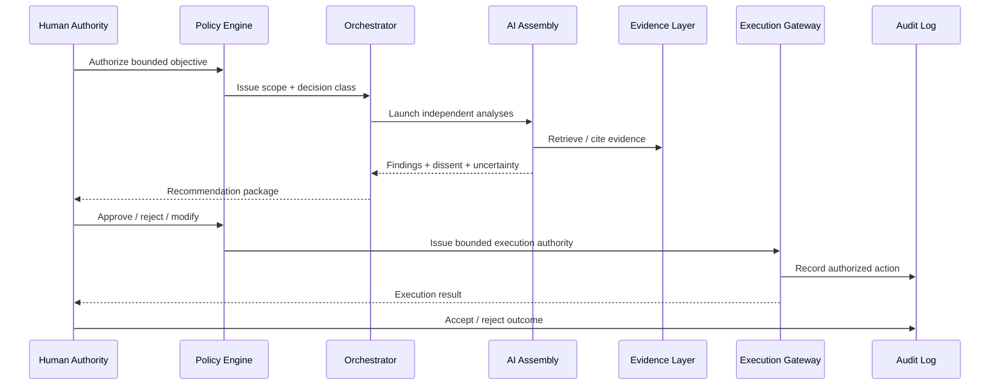

# Reference Architecture

**Status:** Proposed architecture  
**Maturity:** Research / concept

The architecture intentionally separates intelligence from authority and authority from execution.

---

## Layer 0 — Human Governance

Defines:

- who has authority
- succession rules
- decision classes
- approval thresholds
- emergency powers
- revocation
- conflict resolution

This layer is sovereign.

AI can advise on governance changes but cannot authorize its own authority expansion.

---

## Layer 1 — Policy & Authorization

Machine-readable policies translate governance into enforceable controls.

Examples:

- which roles can approve which decision classes
- when a cooling-off period applies
- when second-human confirmation is required
- what requires multi-signature approval
- what execution scopes are reversible
- which devices or channels are trusted
- expiry of delegated authority

**Design requirement:** policy should be inspectable and versioned.

---

## Layer 2 — Orchestration

The orchestrator:

- decomposes tasks
- selects models / agents
- enforces independence where required
- routes evidence
- collects outputs
- preserves dissent
- applies decision protocol
- blocks unauthorized execution

The orchestrator is not sovereign.

A compromised orchestrator should not be able to grant itself higher authority.

---

## Layer 3 — Independent AI Assembly

The assembly may contain:

- general reasoning agents
- domain specialists
- skeptical reviewers
- red-team agents
- legal / financial / technical specialists
- forecasting agents
- evidence auditors
- synthesis agents

### Independence requirement

“Multiple agents” only adds value when failure modes are not fully correlated.

Diversity may require differences in:

- model family
- provider
- prompt
- role
- evidence subset
- method
- sampling
- temporal snapshot

---

## Layer 4 — Evidence & Research

Stores or references:

- primary sources
- records
- documents
- structured data
- external research
- timestamps
- source provenance
- confidence / uncertainty
- superseded evidence

Evidence is not rewritten merely because a later interpretation changes.

---

## Layer 5 — Family Memory & Knowledge

Canonical memory should distinguish:

- source facts
- family decisions
- preferences
- policies
- entities and relationships
- institutional history
- lessons learned
- unresolved questions
- superseded beliefs

### Memory rule

Correction should preserve history:

**prior state → new evidence → update reason → current state**

Do not silently mutate the past.

---

## Layer 6 — Execution Gateway

Execution tools may include:

- communications
- document workflows
- scheduling
- finance systems
- research services
- repositories
- approved business applications

Execution is isolated behind a permission gateway.

The gateway should enforce:

- least privilege
- scope
- expiration
- rate / value limits
- human approval where required
- transaction verification
- audit logging
- emergency stop

---

## Layer 7 — Sovereign Infrastructure

Proposed sovereign components may include:

- dedicated servers
- encrypted storage
- local inference
- family identity and key infrastructure
- canonical policy store
- audit store
- secrets management
- backups
- recovery systems

A dedicated-server model in Romania is one infrastructure option under evaluation, not an implemented claim.

---

## Layer 8 — External Intelligence

Third-party cloud models and services can provide:

- frontier reasoning
- specialist capability
- search
- data feeds
- elastic compute
- redundancy
- comparative judgment

The architecture should assume external providers can:

- change models
- change terms
- become unavailable
- drift in behavior
- fail
- be compromised

Critical family authority should therefore not depend on one provider.

---

# Trust Boundaries

At minimum, SFII should treat these as separate trust zones:

1. human identity / authority
2. policy engine
3. orchestrator
4. model providers
5. canonical memory
6. external evidence
7. execution connectors
8. cryptographic keys
9. audit system
10. backup / recovery

A single compromise should not automatically collapse every zone.

---

# Reference Flow

---

# Architecture Test

A reference implementation should demonstrate that:

- an agent cannot grant itself execution authority
- recommendation can fail without corrupting evidence
- one provider can be removed without destroying canonical memory
- dissent survives synthesis
- policy changes are versioned
- execution authority expires
- revocation works
- audit records remain available after component failure
